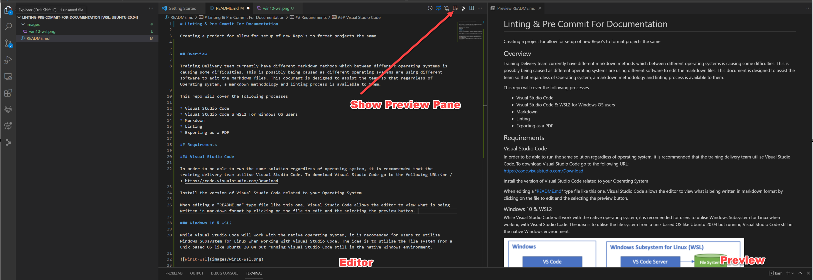
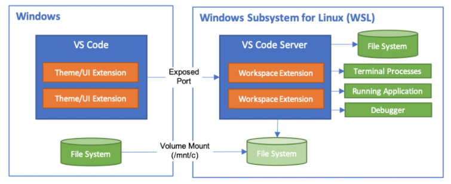

# Linting & Pre Commit For Documentation

Creating a project for allow for setup of new Repo's to format projects with consistency regardless of the operating system.

Linting is the process of "checking" the files to ensure that there are not issues syntax wise before commit. Many different linting extensions exists and can be used depending on the reason. A quick overview on why it can assist can be found here: </br>
https://www.freecodecamp.org/news/what-is-linting-and-how-can-it-save-you-time

Please note, if you are going to use Linting processes, ensure they don't go overkill as they can be very time consuming.

Pre-Commit on the other hand is a "git hook" script that when it runs (with required configuration) will run the tests from the linting process. Example of these include creating documentation automatically in the cases of Terraform-Docs and also removing trailing whitespaces from files such as README.md.

Depending on what you are working on and why style of file, you can configure the [.pre-commit-config.yaml] file to setup these arguments before being able to commit the changes.


## Overview

If your team currently has different markdown software which between different operating systems this may cause some difficulties. This is possibly being caused as different operating systems are using different software to edit the markdown files. This document is designed to assist the team so that regardless of Operating system, a markdown methodology and linting process is available to them.

This repo will cover the following processes

* Visual Studio Code
* Visual Studio Code & WSL2 for Windows OS users
* Extension Packs for Visual Studio Code
* Pre-Commit Hooks
* Exporting as a PDF in Visual Studio Code

## Requirements

### Visual Studio Code

In order to be able to run the same solution regardless of operating system, it is recommended that the training delivery team utilise Visual Studio Code. To download Visual Studio Code go to the following URL:<br /> https://code.visualstudio.com/Download

Install the version of Visual Studio Code related to your Operating System

When editing a "README.md" type file like this one, Visual Studio Code allows the editor to view what is being written in markdown format by clicking on the file to edit and the selecting the preview button.



The idea of all staff using the same editor should resolve issues between different operating systems/programs which are not compatible with each other. Using the same software should resolve this problem.

### Windows 10 & WSL2

While Visual Studio Code will work with the native operating system, it is recomended for users to utilise Windows Subsystem for Linux when working with Visual Studio Code. The idea is to utilise the file system from a unix based OS like Ubuntu 20.04 but running Visual Studio Code still in the native Windows environment.



Install WSL and upgrade to WSL2 using the following instructions. You will need to chose from the Microsoft Store which version of Linux to use.

* https://docs.microsoft.com/en-us/windows/wsl/install-win10

### Extension packs in Visual Studio Code

Recommended extension for Visual Studio Code include the following:

* Git History - VS Marketplace Link: https://marketplace.visualstudio.com/items?itemName=donjayamanne.githistory
* Git History Diff - VS Marketplace Link: https://marketplace.visualstudio.com/items?itemName=huizhou.githd
* GitLab Workflow - VS Marketplace Link: https://marketplace.visualstudio.com/items?itemName=GitLab.gitlab-workflow
* Markdown PDF - VS Marketplace Link: https://marketplace.visualstudio.com/items?itemName=yzane.markdown-pdf

All Extensions come with installation and usage guides when selected from the Extension button in Visual Studio Code.

### PreCommit Hooks

Before committing changes to this repository, ensure you have [precommit](https://pre-commit.com/) installed locally, e.g;

```bash
$ pip install --upgrade --user pre-commit
Collecting pre-commit
  Downloading pre_commit-2.4.0-py2.py3-none-any.whl (171 kB)
     |████████████████████████████████| 171 kB 3.0 MB/s
Installing collected packages: pre-commit
  Attempting uninstall: pre-commit
    Found existing installation: pre-commit 2.3.0
    Uninstalling pre-commit-2.3.0:
      Successfully uninstalled pre-commit-2.3.0
Successfully installed pre-commit-2.4.0
```

then initialise the git hooks from this repo's `.pre-commit-config.yaml`;

```bash
$ pre-commit install
pre-commit installed at .git/hooks/pre-commit
```

To automatically install precommit hooks for any future git repo which uses this framework, create the following init templatedir;

```bash
DIR=~/.git-template
git config --global init.templateDir ${DIR}
pre-commit init-templatedir -t pre-commit ${DIR}
```

### On Commit

Pre-Commit is executed when commiting and the following checks are run.

```bash
> git -c user.useConfigOnly=true commit --quiet --allow-empty-message --file -
Trim Trailing Whitespace.................................................Failed
- hook id: trailing-whitespace
- exit code: 1
- files were modified by this hook

Fixing README.md

Fix End of Files.........................................................Failed
- hook id: end-of-file-fixer
- exit code: 1
- files were modified by this hook

Fixing README.md

Check for merge conflicts................................................Passed
Check Yaml...............................................................Passed
Check for added large files..............................................Passed
```

Failed means that there was a change on the file and therefore was successful in applying that argument.

Please note: When you run pre-commit, file changes will occur. You will need to re-add those file into your commit as a merge before you can push to the repo.

### Markdown to PDF
 Part of the process that is required is a PDF of the Markdown. To make this easy, there is an extension called
 markdown to PDF which is listed above. Please see the extension for the installation instructions by selecting the extension.

 If you are using Visual Studio Code with WSL, you can right click the PDF file once created and select "Download" to download the file to your Windows file structure if the PDF doesn't need to be commited to the repo.
